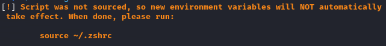

# Script Details

Below is a description of what these scripts do and the setup of this environment. This is a way to organize some of the mundane overhead of CTF's so that a simple, reuable system, could be used. For example:

1. Run `. setup.sh` (one time) to add this folder to you PATH environment variable so that you can call these scripts from anywhere.
2. Run `. newroom.sh` when you are taking on a new CTF room. It sets some environment variables and sets up a working folder where you can take notes and capture files.
3. Run `. chroom.sh` when you want to  change CTF rooms. This changes your environment variables. For example, the `$ROOM` variable will be the full path of where your room folder is, allowing you to run things like: `nmap $TARGET 2>&1 $ROOM/nmap.log` where `$TARGET` is the environment variable of the IP address of the current target machine and where `$ROOM` is the environment variable for the full path of the folder of the room you are currently working on (ex.: `/home/jdoe/ctf/thm/ignite/`).
4. Run `. set-target.sh` to set the IP address of your target. This lets you run commands and use `$TARGET` instead of having to remember the exact IP address.
5. Run `start-recon.sh` to run `nmap`, `gobuster`, and `nikto`, and output the results to `*.log` files with those respective names, in the `$ROOM` folder.


Some other helper scripts:

1. Run `killbyname.sh` to kill a process by name, instead of having to go look up the process id.
2. Run `linpeas-getlatest.sh` checks to see if you have the latest version (or if it's not downloaded) and downloads it to your `~/Downloads/` folder.


## Overview

These scripts related to rooms assumes a fixed folder structure of:

```bash
~/ctf/<PLATFORM>/<ROOM>/
```

So that you can organize your working-folders and/or write-ups by platform, then by room. By "platform", this means: TryHackMe, HackTheBox, etc. The root of this structure is `~/ctf/`. However, this can be overridden by setting the `CTF_HOME` environment variable. For example, append the following to your `~/.zshrc` file and then `source ~/.zshrc` to make it go into effect:

```bash
export CTF_HOME=/home/jdoe/gitlocal/jdoe/my-writeups/src/
```

### Proposed Acronyms

For example, here is what you might use for the "platform" acronym for various services:

| Name/URL                                    | Acronym  | Description                                                                                                                                                           | Pricing                              |
| ------------------------------------------- | -------- | --------------------------------------------------------------------------------------------------------------------------------------------------------------------- | ------------------------------------ |
| [Hack The Box](https://www.hackthebox.eu/)  | `htb`    | Hack The Box (HTB) is one of the most well-known and respected CTF platforms. It offers various challenges covering security domains. Known for its active community. | :free: :dollar: Mix of free and paid |
| [TryHackMe](https://tryhackme.com/)         | `thm`    | TryHackMe focuses on making cybersecurity education accessible. Provides guided paths, rooms with themes, and real-world scenarios.                                   | :free: :dollar: Mix of free and paid |
| [OverTheWire](https://overthewire.org/)     | `otw`    | OverTheWire offers progressive war games for complex challenges. Covers diverse topics for skill development.                                                         | :free: Free                          |
| [Pwnable.kr](https://pwnable.kr/)           | `pkr`    | Pwnable.kr specializes in binary exploitation challenges. Great for learning software vulnerabilities and exploitation techniques.                                    | :free: Free                          |
| [Root Me](https://www.root-me.org/)         | `rme`    | Root Me offers challenges in web, cryptography, reverse engineering, etc. Suitable for all skill levels.                                                              | :free: :dollar: Mix of free and paid |
| [VulnHub](https://www.vulnhub.com/)         | `vlnhb`  | VulnHub provides downloadable VMs with vulnerable configurations. Ideal for practicing penetration testing.                                                           | :free: Free                          |
| [CTF365](https://ctf365.com/)               | `ctf365` | CTF365 offers continuous training and diverse challenges for improving cybersecurity skills.                                                                          | :free: :dollar: Mix of free and paid |
| [Hacker101](https://www.hacker101.com/)     | `h101`   | Hacker101 provides web hacking challenges and tutorials. Valuable for learning web application security.                                                              | :free: Free                          |
| [RingZer0 Team](https://ringzer0ctf.com/)   | `r0ctf`  | RingZer0 Team offers challenges covering various security topics. Enhance skills through practical scenarios.                                                         | :free: Free                          |
| [Hacking-Lab](https://www.hacking-lab.com/) | `hcklb`  | Hacking-Lab offers exercises and challenges for skill development. Used by individuals, institutions, and companies to enhance knowledge.                             | :free: :dollar: Mix of free and paid |

## Scripts

Here are the deatils of the various script.

### Script: `setup.sh`

This script adds this tool directory to the current `PATH` so that you can call these scripts from any folder without having to specify the full path. For example, this folder might be in a `~/gitlocal/jdoe/ctf-helper/src` on your machine where your would otherwise have to specify that full path.

Running `setup.sh` will add the current folder to the `PATH` enviroment variable set in your `~/.zshrc`. This is idempotent and won't add it more than once.

Running `setup.sh --remove` will remove the current folder from the `PATH` environment variable set in your `~/.zshrc`, if it exists.

```bash
Adds this tool directory to the PATH if it doesn't already exist.

  Usage: show_usage [options]

Options:
  --help      Shows this screen.
  --remove    Remove the current folder from the PATH if present.
```

> **NOTE:** You used run `source ~/.zshrc` to have these changes take effect in the current shell/terminal you are in. They will automatically take effect for any new shells going forward.

### Script: `newroom.sh`

TBD

### Script: `chroom.sh`

Changes to an existing Capture the Flag room on your filesystem where you are taking notes.

> **NOTE:** This script should be run with `source` or just a `.` before it so that it will run in the same calling context as your terminal prompt. If not, the script is run in a separate process, which means it can't update the environment variables in your shell. This script will either reload/source your `~/.zshrc` profile, or if this script isn't source, it will show you a message with instructions:
>
> 

```bash
Change to an existing CTF room write-up directory (/home/jdoe/ctf/$PLATFORM/$ROOM_NAME).

  Usage: show_usage <platform> <room_name>

Arguments:
  platform   Should be an acronym for a CTF platform like: "thm" for TryHackMe, or "htb" for HackTheBox, etc.
  room_name  Should be the name of the "room" on the CTF platform, which is usually the last part of the URL.

Set CTF_HOME to the root folder to use, otherwise /home/jdoe/ctf/ is used.
```

### Script: `set-target.sh`

Sets the IP address of your target. This lets you run commands and use an environment variable named `$TARGET` instead of having to remember the exact IP address. For example, you might run:

```bash
nmap -sCV $TARGET 2>&1 nmap-$TARGET.log
```

> **NOTE:** This script should be run with `source` or just a `.` before it so that it will run in the same calling context as your terminal prompt. If not, the script is run in a separate process, which means it can't update the environment variables in your shell. This script will either reload/source your `~/.zshrc` profile, or if this script isn't source, it will show you a message with instructions:
>
> 

Help screen:

```bash
Set the target of your current CTF to the $TARGET environment variable.

  Usage: source ./set-target.sh <target-ip-address>
```


### Script: `start-recon.sh`

TBD - This will be re-worked.

### Script: `killbyname.sh`

As the name suggests, lets you easily kill a process by the name of the executable, instead of having to look up the process id.

```bash
USAGE: ./killbyname.sh [processname]
```

### Script: `linpeas-getlatest.sh`

When working on a CTF, you often want to use [Linpeas](https://github.com/carlospolop/PEASS-ng), but the CTF machines don't typically have access to the internet. What you can do is from your `~/Downloads/` folder run:

```bash
python3 -m http.server 9000
```

So that you can download linpeas from your workstation. Since that script is always changing, this gets the [very latest version from Github](https://github.com/carlospolop/PEASS-ng/releases) and replaces it in your `~/Downloads/` folder. Example output:

```bash
[*] Fetching the latest release URL...
[!] linpeas.sh already exists. Removing...
[*] Downloading the latest version to: /home/d3rb1n/Downloads/linpeas.sh...
linpeas.sh    100%[==============================>] 828.43K  1.67MB/s    in 0.5s    
[+] linpeas.sh has been downloaded successfully.

-rw-r--r-- 1 d3rb1n d3rb1n 848317 Aug 27 00:28 /home/d3rb1n/Downloads/linpeas.sh
```
